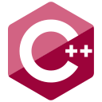

# Привет, меня зовут Дунайцев Александр.

Добро пожаловать в мой github аккаунт. 
В нем я собираюсь публиковать свои пет-проекты, научные работы, университетские задания, курсачи и дипломы, которые представляют наибольший интерес.

Таким образом мы вместе сможем наблюдать мой путь от человека к программисту.

**В сферу моих интересов входит** :
- Разработка на C++.
- Изучение алгоритмов.
- Автомтизация рутины.
- Математика.

**Я работаю со следующими технологиями:**

  
  
  
   
  
  
  
  
  
  
  
    

<!--- ## Текущий проект

ProjectName

Project description in few words.

Ссылка на репозиторий: repo link

--->

<!--- Минимальное поисание + ссылка --->

## Немного статистики:

 

## Связаться со мной

 &nbsp; &nbsp;
 

 
<!---
dunaitseva/dunaitseva is a ✨ special ✨ repository because its `README.md` (this file) appears on your GitHub profile.
You can click the Preview link to take a look at your changes.
--->
